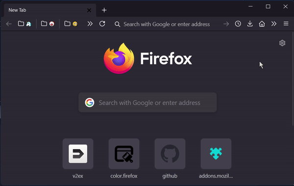
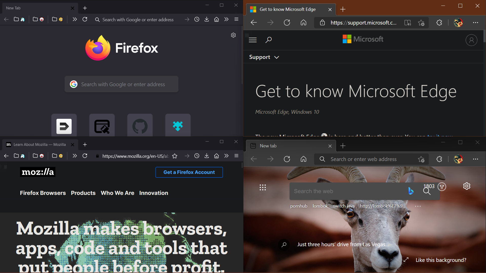
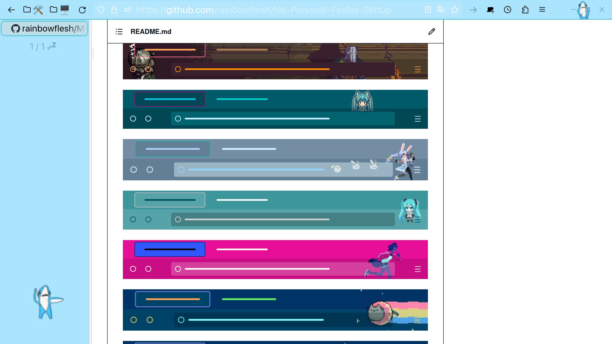

# My Mega FireFox tWeak

Edge style be like:



Compare with real edge:


---

Sidebar belike:


## Dependencies

- Minimal Firefox version: 91.0

- [Tree Style Tab](https://addons.mozilla.org/en-US/firefox/addon/tree-style-tab/?utm_content=addons-manager-reviews-link&utm_medium=firefox-browser&utm_source=firefox-browser)

- [Tab Center Reforn](https://addons.mozilla.org/en-US/firefox/addon/tabcenter-reborn/?utm_source=addons.mozilla.org&utm_medium=referral&utm_content=search) (\*Optional)

## Usage

### about:config

> gfx.webrender.all = true
> layout.css.backdrop-filter.enabled = true
> layout.css.backdrop-filter.enabled-force = true
> toolkit.legacyUserProfileCustomizations.stylesheets = true

### Install Themes

```bash
git clone https://github.com/rainbowflesh/Me-Personal-Firefox-Settup.git
cd Me-Personal-Firefox-Settup

# Make com-for-table in choose,
# and get your profile path by visit
# about:profiles, which `Local Directory` is.
cp -r chrome.$THETHEMEUWANNAUSE $THEPROFILEPATH/chrome

# or use symbol link make upgrade easily
ln -S chrome.$THETHEMEUWANNAUSE $THEPROFILEPATH/chrome
```

### Config sidebar CSS

- On [Tab Center Reforn](https://addons.mozilla.org/en-US/firefox/addon/tabcenter-reborn/?utm_source=addons.mozilla.org&utm_medium=referral&utm_content=search), Import [this](https://raw.githubusercontent.com/rainbowflesh/Me-Personal-Firefox-Settup/main/chrome.sidebar/tabCenterReborn.css) CSS.
- On [Tree Style Tab](moz-extension://f3da60fb-dc11-43f1-a71e-c233dce7aecb/options/options.html#!), locate `Advanced`, Import [this](https://raw.githubusercontent.com/rainbowflesh/Me-Personal-Firefox-Settup/main/chrome.sidebar/treestyletab.css).

---

## 推销主题

[](https://addons.mozilla.org/en-US/firefox/addon/prise-the-sun-dark-souls/)

[](https://addons.mozilla.org/en-US/firefox/addon/neko-miku-theme/)

[](https://addons.mozilla.org/en-US/firefox/addon/pekora-theme/)

[](https://addons.mozilla.org/en-US/firefox/addon/yet-another-mikutheme/)

[](https://addons.mozilla.org/en-US/firefox/addon/run-michirun-run-theme/)

[](https://addons.mozilla.org/en-US/developers/addon/fat-nyan-theme/)

[](https://addons.mozilla.org/en-US/firefox/addon/pop-nyan-theme/)

### 推销插件

- [uBlacklist][1] 屏蔽搜索引擎结果
- [uBlock][2] 屏蔽网页元素
- [reload tab by mid click][3] 中键刷新页面
- [Startup Theme Changer][4] 自动切换主题
- [Nyan Cat ytb][5] ytb 进度条换成 nyan 猫
- [Smart Prevent Duplicate tab][6] 自动关闭重复标签

顺带推销我自己收集的[屏蔽规则][rule]

## References

- 基于 [MaterialFox][10] 制作了 Microsoft Edge 风格的浏览器 ui, 以及 Acrylic 效果.
- 利用 [simpleMenuWizard][11] 精简了右键菜单, 普通人用不上的我肯定也用不上, 遂删之.
- 利用 [firefox-overlay-scrollbar][9] 实现 win10 滚动条效果.

[1]: https://addons.mozilla.org/en-US/firefox/addon/startup-theme-changer/?utm_content=addons-manager-reviews-link&utm_medium=firefox-browser&utm_source=firefox-browser
[2]: https://addons.mozilla.org/en-US/firefox/addon/ublock-origin/
[3]: https://addons.mozilla.org/en-US/firefox/addon/reloadtabbymidclick/
[4]: https://addons.mozilla.org/en-US/firefox/addon/startup-theme-changer/?utm_source=addons.mozilla.org&utm_medium=referral&utm_content=search
[5]: https://addons.mozilla.org/en-US/firefox/addon/nyan-cat-youtube-enhancement/?utm_source=addons.mozilla.org&utm_medium=referral&utm_content=search
[6]: https://addons.mozilla.org/en-US/firefox/addon/smart-prevent-duplicate-tabs/?utm_source=addons.mozilla.org&utm_medium=referral&utm_content=search
[rule]: https://github.com/isNijikawa/Universal-Web-Filter-rules
[7]: ./chrome/EdgeFox/
[8]: ./chrome/simpleMenuWizard/
[9]: https://github.com/spencerwooo/firefox-overlay-scrollbar
[10]: https://github.com/muckSponge/MaterialFox
[11]: https://github.com/stonecrusher/simpleMenuWizard
[readme]: https://github.com/isNijikawa/EdgeFox/blob/main/asset/guid.md
